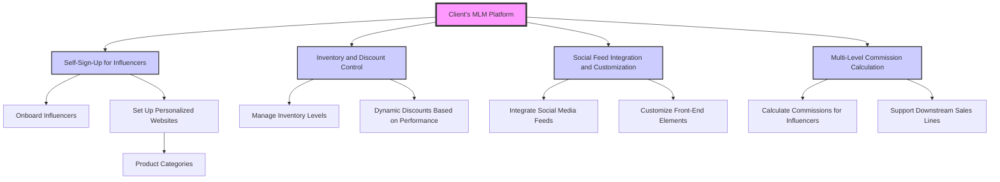

# SHOPLINE_interview_assignment
This repository contains the assignment given by SHOPLINE to Benjamin Dean a final step of the interview process for the Open Platform Expert &amp; Head of Developer Experience role.

## Original Assignment Instructions from SHOPLINE

## Contextual Overview 
**Context** A client is planning to develop a multi-level marketing (MLM) Platform using, SHOPLINE's APIs and Webhooks, to manage influencer Partnerships for their e-commerce operations. The pIattorm's primary functionalities must include:

1. Self-Sign-Up tor influencers: Enable influencers to onboard themselves and automatically set up personalized websites where the can sell products across up to ten (10) distinct categories of branded product lines.

2. Inventory and Discount Control: The client must be able to manage inventory levels and offer discounts dynamically, based on the sales performance metrics of each influencer.

3. Social Feed integration and Customization: Influencers should have the tools to integrate their social media feeds into their websites and customize front-end elements to suit their branding needs.

4. Multi-Level Commission Calculation: The platform needs to calculate commissions for influencers, and their downstream sales lines (supporting the MLM business model). 

### Functional Overview

# Assignment Success Requirements

## Topic One (1)

###  Create needed sequence diagrams:
* Design different sequence diagrams that map out the interactions between the client's [MLM] system, [brand] influencers, and the Shopline's REST API and/or webhooks needed to satisfy the functionalities of this assignment's [Contextual Overview](#contextual-overview).
* The diagrams should clearly illustrate all relevant API calls, data flows, and system responses

### Prototvoe Missing APlEndooints:
* Suppose...during develoment you identify an essential APl endpoint is missing from SHOPLINE's Developer Portal. Explain how you would go about prototyping this endooint, iincluding:
	*** Defining endpoint requirements (functionality, method, etc.)
	*** Designing the AP interface (URl design, request/response structures)
	*** Documenting the endpoint for use by the development team

## Topic Two (2)

### Comparison: Shopify's API-enabled e-commerce capabilities
* What do you think are the areas where SHOPLINE open e-commerce capabilities lack?
* Provide 2-3 specific examples
