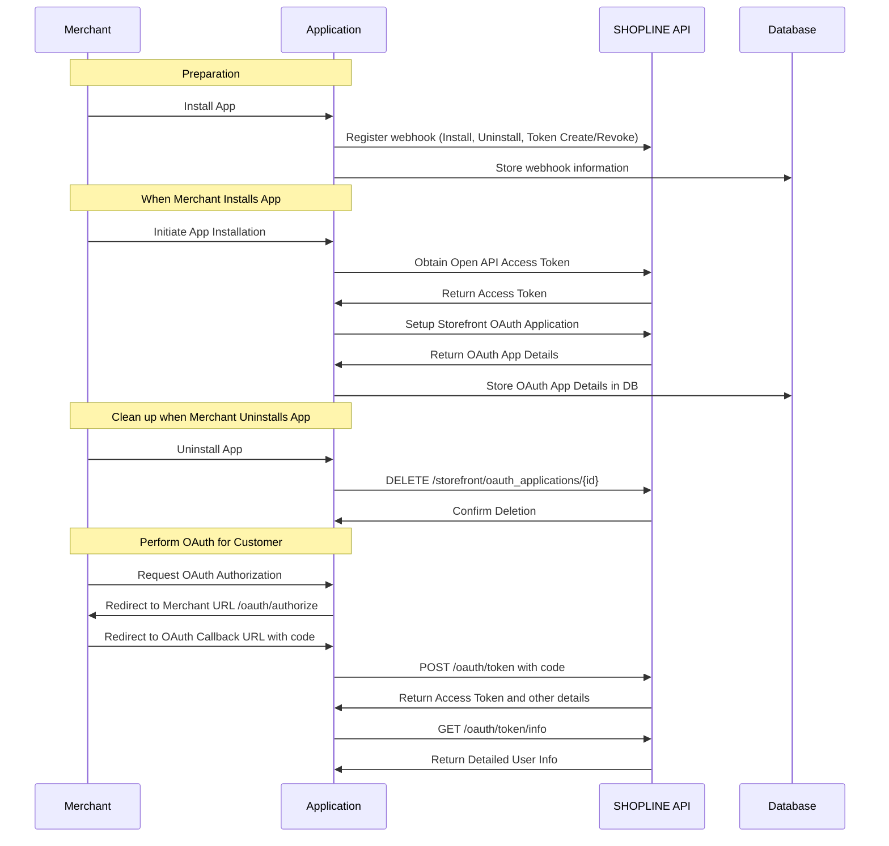

# Self-Sign-Up for Influencers

**Self-Sign-Up tor influencers:** Enable influencers to onboard themselves and automatically set up personalized websites where the can sell products across up to ten (10) distinct categories of branded product lines.

## Developer Center App
* App Scope: Public
	* Merchant > Show
	* Storefront Oauth Applications > Show, Create, Delete
* Submit for approval
* Webhook: Register for Application > Install, Application > Uninstall , Access Token > Create and Access Token > Revoke webhooks, > Sales Channel > Order Paid Successfully.

## On-board Influencers (Register Influencer)

### Influencer Installs App

### Create Website for Influencer

1. Create storefront oauth app when influencer installs app: POST https://open.shopline.io/v1/storefront/oauth_applications

### Select Product Categories to add to storefront

1. Get list of categories to display to influencer
2. When influencer selects a product category, get the collection_id, and store in db
3. If influencer has selected 10 product categories:
	1. Disable adding new product categories
	2. Display message must remove one before adding another
	3. If influencer removes a product category, toggle ability to add product category 
