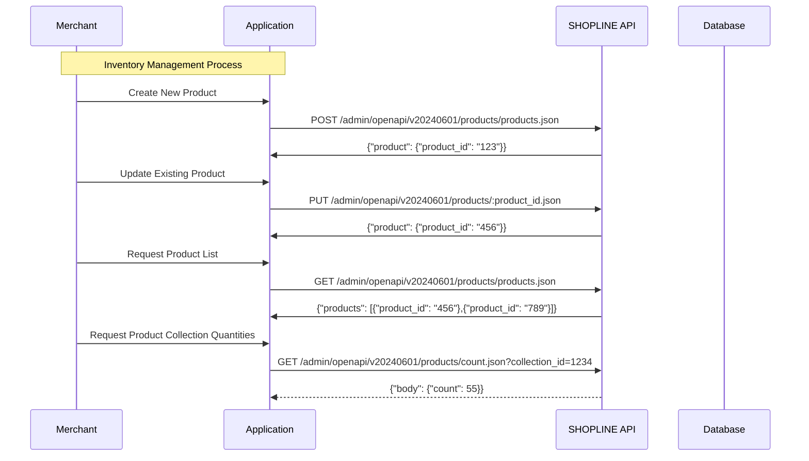

# Inventory and Discount Control

## APIs Needed:

### Inventory Management

#### Product Management

#### Product Category Management
	##### SKUs (optional)
	* POST - Create SKU: https://developer.shopline.com/docsv2/ec20/cdb180dc069f7d8d6877c0cdffe96f73/zYmEnSCX?version=v20240601
	* PUT - Update SKU by ID: https://developer.shopline.com/docsv2/ec20/cdb180dc069f7d8d6877c0cdffe96f73/0oMgmhd1?version=v20240601
	* GET - List SKUs of single product: https://developer.shopline.com/docsv2/ec20/cdb180dc069f7d8d6877c0cdffe96f73/gH8FLtIV?version=v20240601
	* GET - SKU by ID: https://developer.shopline.com/docsv2/ec20/cdb180dc069f7d8d6877c0cdffe96f73/GKoQk4QN?version=v20240601
	* DELETE - Delete SKU: https://developer.shopline.com/docsv2/ec20/cdb180dc069f7d8d6877c0cdffe96f73/PMRZxmYD?version=v20240601
	
	##### Collections (aka: Collections)
	* POST - Create manual collection: https://developer.shopline.com/docsv2/ec20/cdb180dc069f7d8d6877c0cdffe96f73/o3srMVaz?version=v20240601
	* PUT - Update manual collection: https://developer.shopline.com/docsv2/ec20/cdb180dc069f7d8d6877c0cdffe96f73/w2ko4TRJ?version=v20240601
	* GET - List
	* GET - Manual Collection by ID: https://developer.shopline.com/docsv2/ec20/cdb180dc069f7d8d6877c0cdffe96f73/CIRhlpPI?version=v20240601
	* DELETE - Delete manual collection: https://developer.shopline.com/docsv2/ec20/cdb180dc069f7d8d6877c0cdffe96f73/VyWnMCXu?version=v20240601

	##### Products
	* POST - Create a Product: https://developer.shopline.com/docsv2/ec20/cdb180dc069f7d8d6877c0cdffe96f73/7EBTln5x?version=v20240601
	* PUT - Update a Product: https://developer.shopline.com/docsv2/ec20/cdb180dc069f7d8d6877c0cdffe96f73/MGsGAKml?version=v20240601
	* GET - Query Product List: https://developer.shopline.com/docsv2/ec20/cdb180dc069f7d8d6877c0cdffe96f73/P0FAlOwy?version=v20240601
	* GET - Product by ID: https://developer.shopline.com/docsv2/ec20/cdb180dc069f7d8d6877c0cdffe96f73/GiOQ66py?version=v20240601
	* DELETE - Delete product: https://developer.shopline.com/docsv2/ec20/cdb180dc069f7d8d6877c0cdffe96f73/fz5jcTPd?version=v20240601

	##### Product Images
	* POST - Create Product Images: https://developer.shopline.com/docsv2/ec20/cdb180dc069f7d8d6877c0cdffe96f73/qiYfBJq2?version=v20240601
	* PUT - Update Product Image: https://developer.shopline.com/docsv2/ec20/cdb180dc069f7d8d6877c0cdffe96f73/xa5jJ8Da?version=v20240601
	* GET - Query Product Image List: https://developer.shopline.com/docsv2/ec20/cdb180dc069f7d8d6877c0cdffe96f73/II0p453B?version=v20240601
	* GET - Product Image by ID: https://developer.shopline.com/docsv2/ec20/cdb180dc069f7d8d6877c0cdffe96f73/gOmDm8hS?version=v20240601
	* DELETE - Product Image: https://developer.shopline.com/docsv2/ec20/cdb180dc069f7d8d6877c0cdffe96f73/MbgQbxC7?version=v20240601
	

	##### Inventory
	* POST - Set inventory status: https://developer.shopline.com/docsv2/ec20/cdb180dc069f7d8d6877c0cdffe96f73/SSpgCuDk?version=v20240601
	* PUT - Update single stock object: https://developer.shopline.com/docsv2/ec20/cdb180dc069f7d8d6877c0cdffe96f73/vQtxgfbm?version=v20240601
	* GET - Batch Query Inventory object: https://developer.shopline.com/docsv2/ec20/cdb180dc069f7d8d6877c0cdffe96f73/GnjCMmxU?version=v20240601
	* GET - Inventory object: https://developer.shopline.com/docsv2/ec20/cdb180dc069f7d8d6877c0cdffe96f73/GRztkC2L?version=v20240601
	* DELETE - Disconnect stock status: https://developer.shopline.com/docsv2/ec20/cdb180dc069f7d8d6877c0cdffe96f73/sPa02Hzo?version=v20240601

	* Create Product-Category Relationship: https://developer.shopline.com/docsv2/ec20/cdb180dc069f7d8d6877c0cdffe96f73/Tvz7cBoA?version=v20240601
		Req. Params: collection_id + product_id
	* Delete Product-Category Relationship: https://developer.shopline.com/docsv2/ec20/cdb180dc069f7d8d6877c0cdffe96f73/d5scryTc?version=v20240601
		Req. Params: id from Product-Category Relationship Response

### Discount Codes & Price Rules
	* POST - Create Price rule: https://developer.shopline.com/docsv2/ec20/cdb180dc069f7d8d6877c0cdffe96f73/ocBhdsBT?version=v20240601
	* PUT - Update existing price rule: https://developer.shopline.com/docsv2/ec20/cdb180dc069f7d8d6877c0cdffe96f73/tYV0JEO6?version=v20240601
	* DELETE - Delete existing price rule: https://developer.shopline.com/docsv2/ec20/cdb180dc069f7d8d6877c0cdffe96f73/qRsmYCe5?version=v20240601
	* GET - List Price Rules: https://developer.shopline.com/docsv2/ec20/cdb180dc069f7d8d6877c0cdffe96f73/kQAPSSVD?version=v20240601
	* GET - Price Rule: https://developer.shopline.com/docsv2/ec20/cdb180dc069f7d8d6877c0cdffe96f73/EGNINDJR?version=v20240601

	* POST - Create Discount Code: https://developer.shopline.com/docsv2/ec20/cdb180dc069f7d8d6877c0cdffe96f73/NZxEIBPL?version=v20240601
	* PUT - Update Discount Code: https://developer.shopline.com/docsv2/ec20/cdb180dc069f7d8d6877c0cdffe96f73/sutz8VNv?version=v20240601
	* GET - List Discount Codes: 
	* GET - Discount Code:  https://developer.shopline.com/docsv2/ec20/cdb180dc069f7d8d6877c0cdffe96f73/IjYM4W3l?version=v20240601
	* DELETE - Delete Discount Code:  https://developer.shopline.com/docsv2/ec20/cdb180dc069f7d8d6877c0cdffe96f73/pqlkNkS9?version=v20240601

	* GET - Query Product Information in a Specific Collection (Category): https://developer.shopline.com/docsv2/ec20/cdb180dc069f7d8d6877c0cdffe96f73/6nf1FLgi?version=v20240601
